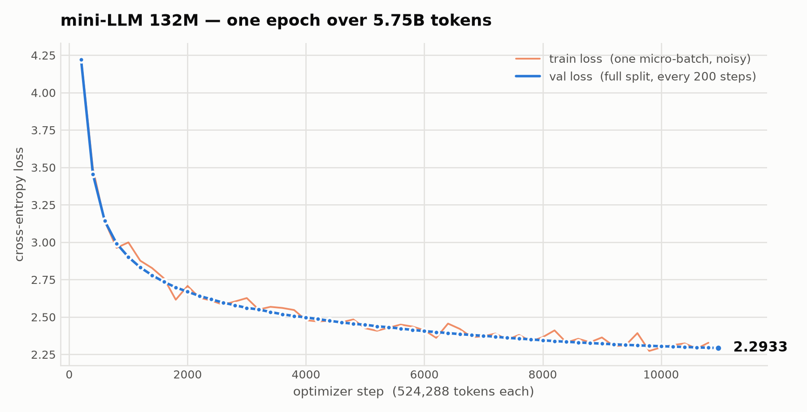

# 🧠 Building a Modern 130M Parameter Language Model from Scratch.

The goal was to build the mini architecture of Chatgpt as it is actually written today and to understand each piece well enough to write it, test it, and prove it correct rather than merely plausible.

## 🚀 Result
A 132M-parameter model in 1,790 lines of Python across ten modules, with three third-party dependencies (`torch`, `numpy`, `regex`). Apart from PyTorch's tensor ops, not a line comes from `transformers` or `tiktoken`. Pretrained for 7.4 hours on 5.75B tokens on a single H100.

### Tranining Curve
<picture>
  <source media="(prefers-color-scheme: dark)" srcset="docs/loss-curve-dark.png">
  
</picture>

Final validation loss **2.2933**, **0.8523 bits per byte**. The two curves sit on top of each other the whole way, which is what a single epoch looks like: every token is seen exactly once, so there is nothing to memorize and no gap to open.

### Inference Example

**Prompt**: `"what is the capital of France"`
```
The capital of France is Paris.
```

**Prompt**: `" list the files in the current directory"`
```
$ ls
The files in the current directory are:
$ ls /home/user/ 2>/dev/null.
```

---
# 🎮 Use the model at https://huggingface.co/ye476/mini-llm-132m
## 🏢 The model sturcture

Decoder-only, 12 layers × 12 heads × 768 wide, 1024 context, 132.3M parameters.

**RoPE — rotary position embeddings.** Position enters by rotating Q and K rather than adding a learned vector, and the cache must be indexed by *absolute* position or generation falls apart after the first token.

```python
cos, sin = self.rope_cos[pos:pos + T], self.rope_sin[pos:pos + T]   # pos from the KV cache
Q, K = apply_rope(Q, cos, sin), apply_rope(K, cos, sin)
```

**KV cache.** Keeping K and V per layer makes generation linear instead of quadratic; the mask then correctly turns *off*, because a single query at the end of the sequence has every cached key already in its past.

```python
is_causal = (Q.size(2) == K.size(2))          # False while decoding — and that is correct
out = F.scaled_dot_product_attention(Q, K, V, is_causal = is_causal)
```

**SwiGLU feed-forward.** The gate multiplies a SiLU-activated branch against a linear one, three matrices where GPT-2 used two.

```python
x = F.silu(self.gate(x)) * self.up(x)
x = self.fc2(x)
```

**Pre-norm residuals with RMSNorm.** Normalizing before each sublayer leaves the residual stream a clean identity path from embedding to output.

```python
x = x + self.attention(self.norm1(x), cache)
x = x + self.mlp(self.norm2(x))
```

**Weight tying and residual-scaled init.** Sharing the embedding with `lm_head` saves 18.9M parameters, and shrinking the residual projections keeps 12 layers of summation from inflating the stream's variance.

```python
self.lm_head.weight = self.embedding.token_embedding.weight
residual_std = 0.02 / sqrt(2 * cfg.n_layer)
```

## The tokenizer

Byte-level BPE, 24,576 tokens = 256 bytes + 24,274 merges + 46 special tokens. Three changes took encoding from 7 KB/s to 6.78 MB/s.

**Regex pre-split — the one that improves quality, not just speed.** Merges can never cross a word boundary, so `the` and ` quick` cannot fuse and the vocabulary never fills with cross-word garbage.

```python
for word in SPLIT_PATTERN.findall(content):
    ids.extend(self._encode_word(word))
```

**Iterate the word, not the merge table.** Both lines below select the same pairs, but one walks ~10 entries and the other walks 24,274 — roughly 200× apart at production vocab size.

```python
valid_pair = [pair for pair in self.merges if pair in counts]   # A: walks 24,274
valid_pair = [pair for pair in counts if pair in self.merges]   # B: walks ~10
```

**Word-level encode cache.** A word's encoding never depends on context, so it is computed once — 93% hit rate on real code, capped because code corpora never converge on a fixed vocabulary.

```python
cached = self.cache.get(word)
if cached is not None:
    return cached
```

| Implementation | Throughput | Compression |
| --- | --- | --- |
| mini-LLM (cold cache) | 5.77 MB/s | 3.81 chars/token |
| mini-LLM (warm cache) | **18.08 MB/s** | 3.81 |
| tiktoken `cl100k_base` (Rust) | 20.03 MB/s | 4.16 |

*2 MB of real Python source, Apple Silicon, single thread.* Pure Python reaching 90% of a Rust implementation, and **92% of `cl100k_base`'s compression from a quarter of its vocabulary** — which also means a much cheaper embedding and lm_head.

The more interesting question is the next one: **what makes me confident A and B are equivalent?** "It got faster" and "it got faster and wrong" look identical in a log. Every optimization here ships with a reference implementation too dumb to be wrong and a test asserting the two agree token for token. That caught three real bugs, including a cache that was read but never written — every result correct, every test green, and no speedup at all.

## Why start here instead of nanochat

[nanochat](https://github.com/karpathy/nanochat) is the better project: more complete, better optimized, written by someone who has done this many times. This one is a gentler on-ramp to the same understanding.

| | mini-LLM | nanochat |
| --- | --- | --- |
| Hardware for a full run | **1 GPU** | an 8×H100 node |
| Wall clock / cost | 7.4 h / ~$25 | ~1.5 h / ~$48 |
| Core modules | **10** | ~35 |
| Distributed training code | **none** | DDP / torchrun |
| Stages covered | tokenizer → pretrain → SFT → sampling | also midtraining, RL, eval |

Renting one H100 is something you can do on a whim; an 8-GPU node is a different kind of decision. More to the point, `pretrain.py` is ordinary PyTorch with no `torchrun` and no rank juggling, readable top to bottom without first learning distributed primitives.

## Quick start

```bash
uv sync
cd src/main

python3 test.py        # 26 consistency tests, no corpus needed
python3 prepare.py     # corpus -> tokenizer -> token shards
python3 pretrain.py    # pretrain
python3 train.py       # SFT
python3 sampling.py    # generate
```

The trained tokenizer ships with the repository (`data/tok.json`), so the throughput benchmark above reproduces without downloading any corpus.

```
src/main/
├── model.py       Transformer (RoPE / RMSNorm / SwiGLU / KV cache)
├── tokenizer.py   BPE tokenizer + chat template
├── dataset.py     domain mixer / shard read-write / SFT dataset
├── prepare.py     corpus -> tokenizer -> shards
├── pretrain.py    pretraining          train.py     SFT
├── sampling.py    sampling and chat    common.py    checkpoints / schedule / bpb
├── config.py      every hyperparameter test.py      26 consistency tests
└── tools/         corpus builder, loss plot
```

## Fine-tuning on the base model

**The trained weights are public:** [huggingface.co/ye476/mini-llm-132m](https://huggingface.co/ye476/mini-llm-132m)

```python
from huggingface_hub import hf_hub_download
path = hf_hub_download('ye476/mini-llm-132m', 'mini-llm-sft.pt')   # or 'mini-llm-base.pt'
```

`export_model.py` is what produced them — it drops the AdamW state, two thirds of a training checkpoint and useless for anything but resuming pretraining:

```bash
python3 export_model.py --ckpt data/pretrain_checkpoint.pt --out mini-llm-base.pt
python3 train.py --data your_data.jsonl --base mini-llm-base.pt --out sft.pt
```

One conversation per line, roles `system` / `user` / `assistant` / `tool`, only assistant spans supervised. Tool calls use the OpenAI `tool_calls` / `tool_call_id` shape; `data/sft_toy.jsonl` has a worked example.

**Know the limits before pointing it at real data.** The SFT loop is deliberately minimal: fp32, `batch_size = 2`, no gradient accumulation, checkpoints only at epoch end, and `SFTConfig` tuned for a 6-conversation toy file. And one that bites silently — **a conversation longer than 1024 tokens keeps only its tail**, so the system prompt and the original task scroll out of the window while training proceeds without complaint. A SWE-bench style agent trace runs 40k+ tokens, of which this model sees 2%.

## The training run

One epoch, 10,967 optimizer steps at 524,288 tokens each, on one H100 SXM.

| | |
| --- | --- |
| Corpus | 22 GB raw → 5,750,197,205 train tokens (116 shards) + 2,001,461 val |
| Throughput | 2.44 s/step, 215k tokens/s, ~20% MFU |
| Wall clock / cost | 7.4 hours / ~$25 |
| Final val loss / bpb | **2.2921** / **0.8518** |

Machinery the run needed: gradient accumulation (32 micro-batches into one 524,288-token step), bf16 autocast where CUDA supports it, a cosine schedule counted in optimizer steps, and mid-epoch resumable checkpoints — the unglamorous one, since a 7.4-hour run that can only checkpoint at the end is a run you lose to a single disconnection.

Validation loss fell at every one of the 54 evaluation points and tracked the training loss within 0.03 throughout. The curve fits a power law `L = 48.7·s^-0.596 + 2.12` with R² = 0.9978, and was still descending when the corpus ran out. At ~20% MFU the H100 was underused — most likely the missing `torch.compile` and the size of the logits tensor over a 24,576-entry vocabulary.

## The fine-tuning run

Two epochs over 122,012 conversations, 15,252 steps, on the same H100.

| | |
| --- | --- |
| General instructions | ~74,000 from UltraChat-200k that fit the 1024-token window |
| **Agent trajectories** | **47,891 windowed samples** |
| Final val loss / bpb | **0.9610** / **0.5637** |

The agent half came from 1,808 SWE-bench and Terminal-Bench trials, of which 1,329 scored `reward=1`. Those trajectories run 40,861 tokens at the median against a 1024-token context, and their agent system prompt alone is 1,042 tokens — so `tools/build_agent_sft.py` swaps in a one-line prompt and emits one sample per assistant turn carrying the task plus the last six messages. That averages 1,007 tokens per sample at 48% supervised.

What comes out, sampled at temperature 0.7:

```
> what is python
Pascal is a programming language that is used extensively to develop and test
programming capabilities. It is commonly used in programming languages such as
Java, JavaScript, and Ruby on Rails.

> list the files in the current directory
The current directory is the current directory:

    $ ls

The files in the current directory are:

    $ ls /home/user/ 2>/dev/null

Note: The `ls` command is used to list all files in the cu
```

The first answer is well-formed English about the wrong language: 132M parameters buy grammar, not facts. The second is the more interesting one — it reaches for `ls`, wraps it in a code block, and appends an explanation. That terminal reflex is the agent trajectories showing through, and it is the clearest evidence the windowing actually taught it something.

One thing this run got wrong first: `SFTConfig` still carried the step counts tuned for the 6-conversation toy file, so the cosine schedule finished at step 150 while the data needed 15,252. The learning rate sat pinned at its floor for thousands of steps before it was caught. The README had warned about exactly this; writing the warning is not the same as heeding it.

## References and caveats

- [karpathy/nanoGPT](https://github.com/karpathy/nanoGPT) and [karpathy/nanochat](https://github.com/karpathy/nanochat) — the latter is the main reference for architecture choices and chat template design.
- Every performance number was measured on the hardware named beside it. The baseline behind "990×" is my own first naive implementation, not any mature library, and the "~200×" at 24,274 merges is extrapolated from measured points at 500 and 3,000.
- **bpb is only comparable on the same evaluation data.** The 0.8523 above is measured on this project's own validation split, which is 40% code and therefore more predictable than prose. It is not comparable to bpb published against WikiText or C4.

MIT.
